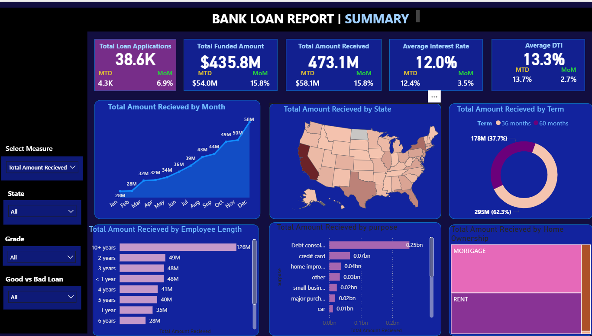
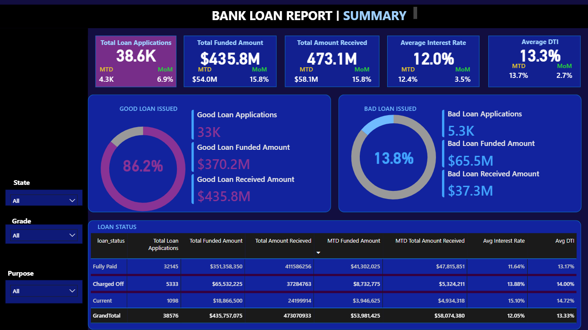

# 📊 Bank Loan Analysis Dashboard (Power BI & SQL)

## 📌 Project Overview
This project delivers an interactive **Bank Loan Analysis Dashboard** built using **Power BI**, **SQL**, and **DAX** to analyze loan applications, funding performance, repayments, and credit risk.

The solution transforms raw loan data into actionable insights to support data-driven decision-making for banking and lending operations.

---

## 🎯 Business Objectives
- Monitor overall loan application and funding performance
- Track **Month-to-Date (MTD)** and **Month-over-Month (MoM)** trends
- Analyze **Good vs Bad Loan** distribution
- Identify high-risk borrower segments
- Understand loan behavior by **state, term, purpose, employment length, and home ownership**
- Support credit risk assessment and portfolio optimization

---

## 📈 Key Metrics (KPIs)
- Total Loan Applications
- Total Funded Amount
- Total Amount Received
- Average Interest Rate
- Average Debt-to-Income (DTI)
- Good Loan vs Bad Loan Percentage
- MTD & MoM Performance Indicators

---

## 🧠 Key Insights
- 86.2% of loans are classified as Good Loans, indicating a healthy portfolio
- Loan applications and repayments show a consistent upward monthly trend
- Debt consolidation is the dominant loan purpose
- 60-month loan terms are more popular than 36-month terms
- Borrowers with 10+ years employment history contribute the highest loan value
- Bad loans are associated with higher interest rates and higher DTI
- Loan activity is concentrated in high-population states

---

## 🛠 Tools, Technologies & Skills Used

### 🔹 SQL (Data Extraction & Transformation)
- Created databases and tables
- Wrote complex queries using:
  - `SELECT`, `WHERE`, `ORDER BY`
  - `GROUP BY`, `COUNT`, `DISTINCT`
  - `CAST`, `DECIMAL`
  - Date functions: `DATENAME`, `DATEPART`, `MONTH`, `DAY`, `QUARTER`, `HOUR`
  - Common Table Expressions (CTEs)
  - Window functions with `PARTITION BY`
- Data filtering, aggregation, and optimization for reporting

---

### 🔹 Power BI & Data Modeling
- Connected Power BI directly to SQL Server
- Performed data cleaning and transformation using Power Query
- Built a star schema data model
- Created and managed Date Tables
- Established relationships and optimized model performance

---

### 🔹 DAX & Time Intelligence
- Created custom measures and calculated columns using:
  - `CALCULATE`
  - `SUM`, `SUMX`
  - Filter functions
  - Date & Time Intelligence functions
  - Text and conditional logic functions
- Built dynamic KPIs including:
  - MTD metrics
  - MoM growth calculations
  - Percentage-based performance indicators

---

### 🔹 Data Visualization & Dashboard Design
- Designed KPI cards and new card visuals
- Built interactive charts (line, bar, donut, map, table)
- Implemented slicers for dynamic filtering
- Applied advanced formatting for readability and storytelling
- Created intuitive navigation for seamless user experience

---

